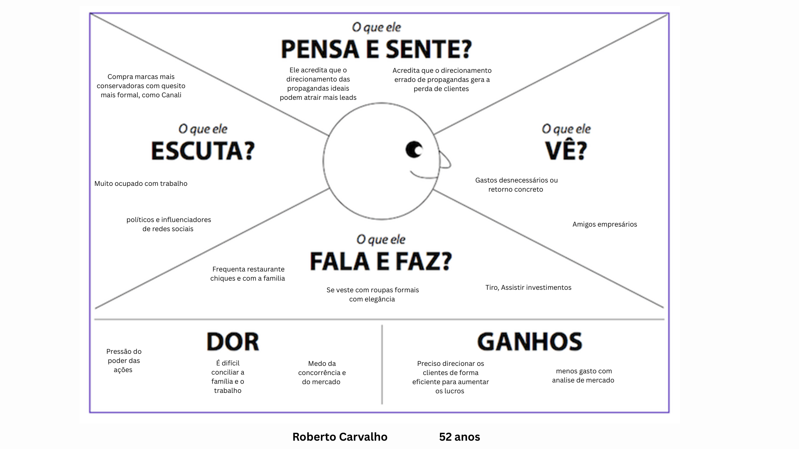

# Personas
  
## Persona Primária 
### Roberto Carvalho, executivo ou gestor de marketing - *"Quero simplicidade e facilidade"* 

Roberto Carvalho tem 52 anos, é diretor de marketing de uma empresa de varejo e supervisiona campanhas publicitárias de diferentes canais. Ele valoriza tecnologia, mas prefere soluções que sejam práticas, confiáveis e fáceis de usar. No dia a dia, Roberto lida com muitas informações e decisões estratégicas, e por isso quer que as plataformas de análise de campanhas entreguem resultados claros e objetivos, sem exigir ajustes complexos ou relatórios demorados. Roberto gostaria de uma plataforma que fosse leve, acessível e sem burocracias, e que permitisse testar e analisar campanhas rapidamente, sem precisar instalar softwares ou configurar processos complicados. Ele costuma revisar métricas e resultados no final do dia ou durante momentos de planejamento estratégico. Ele sente a necessidade da simplificação e objetividade de resultados para uma análise rápida em meio ao cotidiano estressante e sobrecarregado.  

## Persona Secundária
### Carla Ribeiro, consumidora digital – *"quero praticidade e coisas que combinem comigo"*

Carla Ribeiro tem 28 anos, trabalha como analista de marketing digital e faz compras online com frequência, principalmente de roupas e cosméticos. Ela gosta de explorar novidades em tecnologia, mas valoriza experiências simples e intuitivas.
No dia a dia, Carla já lida com muita informação e, por isso, quer que os sites onde compra sejam rápidos, objetivos e que entendam o que ela gosta sem que ela precise perder tempo ajustando filtros ou respondendo questionários. Carla também é preocupada com privacidade. Ela só aceita ativar a câmera quando o site explica claramente o que será feito com os dados. Para ela, praticidade vem junto com transparência.
Carla gostaria que o sistema fosse leve e funcionasse direto no navegador, sem precisar instalar nada ou fazer muitos ajustes. Ela costuma fazer compras em casa, no final do dia, quando está relaxada e com tempo para explorar os produtos. A experiência ideal para ela é aquela em que o site “parece entender” seu gosto e oferece opções alinhadas ao seu estilo logo de cara, com base no seu olhar e nas suas reações visuais.

## Persona Negativa
### Cláudia Mendes, comerciante tradicional – *"prefiro o que já conheço e não quero depender de tecnologia complexa"*

Cláudia Mendes tem 59 anos, é proprietária de uma loja de roupas físicas há mais de três décadas e atende um público fiel no bairro onde está localizada. Ela tem pouca presença digital e não tem intenção de expandir seu negócio para o meio online. Usa o WhatsApp para atendimento pontual e, às vezes, posta no Instagram, mas sem regularidade.
Cláudia valoriza o contato direto com os clientes, acredita no poder da vitrine bem montada e das promoções presenciais. Não se sente confortável com sistemas digitais que exigem cadastro, aprendizado técnico ou uso de câmeras. Para ela, tecnologias que envolvem rastreamento de comportamento ou coleta de dados são confusas e pouco confiáveis.
Ela evita qualquer ferramenta que envolva instalação, configuração ou termos técnicos. Acha que esse tipo de solução pode funcionar para grandes empresas, mas não vê valor em aplicar esse tipo de análise no seu modelo de negócio. A experiência ideal para Cláudia é aquela em que ela não precisa depender de ferramentas novas, consegue resolver tudo pessoalmente ou com métodos que já domina. Ela considera que "o que sempre funcionou, continua funcionando."

---

# Mapa de empatia

## Persona Primária 

---

# Contexto de uso

### Ambiente físico:
- Local silencioso, sem ruídos, sem distrações visuais  
- Boa iluminação  
- Usuário a uma distância que seja possível enquadrá-lo na câmera  

### Ambiente digital:
- Navegador com permissão de câmera e cookies ativa  
- Internet estável para envio e recebimento dos dados em tempo real  

### Aspectos culturais e sociais:
- O usuário está inserido numa lógica de consumo rápido e digital, onde decisões de compra são influenciadas por: estímulos visuais, personalização da experiência e recomendações baseadas em comportamento  
- Forte presença do marketing direcionado, moldado por tendências globais, estética e influência de redes sociais
- Valorização da experiência personalizada, com a ideia de que *a marca entende você*  

### Quais informações o sistema deve guardar antes de iniciar a interação?
- Detecção e validação do dispositivo com câmera ou webcam ativa
- Permissão do usuário para uso da câmera e coleta de dados visuais  
- Aceite da política de cookies e privacidade 
- Registro da sessão para fins analíticos (com dados anonimizados)  
- Verificação da iluminação e posicionamento básico do usuário para garantir a eficácia do rastreamento ocular  

### O que normalmente deve estar acontecendo com o ambiente quando o usuário interagir com o serviço?
- O usuário está com o computador ligado, acessando um site de compras ou vitrine virtual 
- Está de frente para a câmera, em um ambiente calmo e com boa iluminação  
- O usuário tem intenção de explorar produtos ou realizar uma compra, mesmo que ainda esteja em processo de decisão  
- O ambiente está propício para uma experiência imersiva, onde o sistema pode captar com precisão os movimentos dos olhos para personalizar a navegação  

---

# Jornada do usuário

### Narrativa

A empresa, enfrentando desafios para entender o comportamento visual dos consumidores no site, descobre o software de eyetracking como uma solução inovadora. Após analisar suas funcionalidades e benefícios, decide contratar o serviço.

Logo após a adesão, a equipe técnica da empresa realiza a integração do sistema ao site de e-commerce. É feita uma configuração inicial, onde a empresa escolhe quais elementos quer monitorar, como: banners promocionais, produtos em destaque e menus de navegação.

A equipe de marketing e design é treinada para utilizar o painel de controle da plataforma, onde poderão acompanhar os dados coletados em tempo real.

### Como começa

1. Com o sistema em funcionamento, os clientes (persona secundária) acessam o site normalmente e, ao consentirem com o uso da webcam, o sistema inicia o rastreamento ocular.  
A câmera capta os pontos de foco do olhar do usuário, e o software começa a registrar dados visuais em tempo real, como: áreas de maior atenção (heatmaps), tempo de fixação nos elementos, padrões de navegação visual.

2. A equipe da empresa começa a monitorar os relatórios visuais, observando padrões como: quais produtos atraem mais atenção, quais áreas estão sendo ignoradas comportamentos de cliques relacionados ao foco visual.

3. Com o passar dos dias, os dados coletados geram insights valiosos. A equipe então realiza análises comparativas entre diferentes campanhas e versões do site, e toma decisões baseadas nesses dados, como: alterar o layout da página, reposicionar botões de chamada para ação, atualizar imagens promocionais e ajustar recomendações personalizadas. 

4. Essas decisões são implementadas no site, e a equipe acompanha os resultados.  
O software passa a ser utilizado como ferramenta de testes, avaliando o impacto direto das mudanças no comportamento visual e nas conversões.

### Como termina

- Com o uso contínuo, a empresa começa a ver resultados concretos: aumento no engajamento visual, mais cliques e maior taxa de conversão  
- O software deixa de ser uma ferramenta experimental e passa a ser parte integrante da estratégia de marketing e UX
- A empresa decide renovar a licença do software e expandir sua aplicação para novas áreas, como: campanhas em vídeo e redes sociais, testes de cartazes promocionais e aplicativos móveis  
- Satisfeita com os resultados, a empresa indica o software para parceiros comerciais e outras áreas internas, consolidando sua confiança na solução

[1] Fonte: Adaptado de <https://hazeshift.com.br/mapa-de-empatia/>
