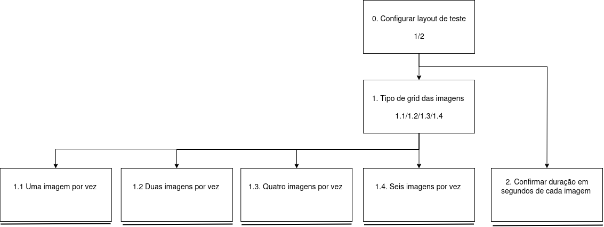
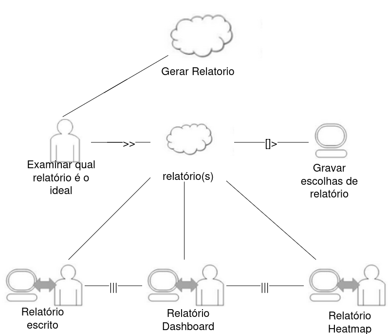

# Análise de Tarefas

> **_NOTE:_**: A equipe deve descrever as funcionalidades mais importantes da interface/produto. A equipe deve modelar pelo menos 1 HTA, 1 GOMS e 1 CTT (de pelo menos 4 funcionalidades diferentes). Cada diagrama deve ter um texto explicando a funcionalidade.

1. HTA
2. GOMS
3. CTT

<h3>1. HTA – Configuração do Layout de Teste</h3>

| Objetivo / Operação                              | Detalhes                                                                                                                                                                                                                                                                                                                                                                          |
|--------------------------------------------------|-----------------------------------------------------------------------------------------------------------------------------------------------------------------------------------------------------------------------------------------------------------------------------------------------------------------------------------------------------------------------------------|
| 0. Configurar layout de teste 1>2                | Input: formulário para configuração de como o teste deve aparecer visualmente; Feedback: as configurações de layout devem ser feitas para que, quando o teste de imagens com rastreamento ocular ocorrer, haja a visualização desejada; Plano: após a escolha do layout das imagens, mostrar um pequeno preview de como elas serão exibidas; Recomendação: evitar poluição visual |
| 1. Tipo de grid das imagens 1.1/1.2/1.3/1.4      | Entrada/Ação: selecionar a quantidade de imagens por vez; Feedback: grid definido; Plano: escolher uma das opções 1.1 a 1.4; Problema/Recomendação: deve mostrar uma caixa em cada uma das opções para o usuário entender melhor como será exibida (uma, duas, quatro, etc.)                                                                                                      |
| 1.1 Uma imagem por vez                           | Entrada/Ação: clicar na opção; Feedback: layout exibido com 1 imagem; Plano: –; Problema/Recomendação: –                                                                                                                                                                                                                                                                          |
| 1.2 Duas imagens por vez                         | Entrada/Ação: clicar na opção; Feedback: layout exibido com 2 imagens; Plano: –; Problema/Recomendação: –                                                                                                                                                                                                                                                                         |
| 1.3 Quatro imagens por vez                       | Entrada/Ação: clicar na opção; Feedback: layout exibido com 4 imagens; Plano: –; Problema/Recomendação: –                                                                                                                                                                                                                                                                         |
| 1.4 Seis imagens por vez                         | Entrada/Ação: clicar na opção; Feedback: layout exibido com 6 imagens; Plano: –; Problema/Recomendação: –                                                                                                                                                                                                                                                                         |
| 2. Duração de cada imagem 2>2.1                  | Entrada/Ação: definir tempo de exibição por imagem; Feedback: tempo definido para cada imagem; Plano: após definir o tempo, confirmar no passo 2.1; Problema/Recomendação: mostrar um pequeno retorno do tempo total do teste em segundos ou minutos, se for o caso                                                                                                               |
| 2.1 Confirmar duração em segundos de cada imagem | Entrada/Ação: confirmar valor digitado ou selecionado; Feedback: duração aplicada às imagens; Plano: –; Problema/Recomendação: –                                                                                                                                                                                                                                                  |

<h3> 2. GOMS – Registrar Imagens</h3>

## GOAL 0: Registrar imagens

---

## GOAL 1: Adicionar imagem 

### METHOD 1.A: Upload manual da imagem  
*(SEL. RULE: a imagem está no dispositivo do usuário)*  
- **OP. 1.A.1:** clicar no botão “Adicionar Imagem”  
- **OP. 1.A.2:** selecionar arquivo de imagem no explorador do sistema  
- **OP. 1.A.3:** confirmar upload  

### METHOD 1.B: Importar imagem do banco de dados do sistema  
*(SEL. RULE: imagem já disponível no sistema)*  
- **OP. 1.B.1:** clicar em “Imagens disponíveis”  
- **OP. 1.B.2:** navegar até a pasta desejada  
- **OP. 1.B.3:** selecionar imagem  
- **OP. 1.B.4:** confirmar importação  

---

## GOAL 2: Associar tags à imagem

### METHOD 2.A: Inserir tags manualmente  
*(SEL. RULE: poucas tags específicas conhecidas pelo usuário)*  
- **OP. 2.A.1:** clicar no campo “Tags”  
- **OP. 2.A.2:** digitar tags  
- **OP. 2.A.3:** confirmar inserção das tags  

### METHOD 2.B: Selecionar tags pré-cadastradas  
*(SEL. RULE: tags já padronizadas no sistema)*  
- **OP. 2.B.1:** clicar em “Selecionar Tags”  
- **OP. 2.B.2:** marcar checkboxes correspondentes  
- **OP. 2.B.3:** confirmar seleção  

---

## GOAL 3: Salvar imagem e tags no banco de dados

- **OP. 3.1:** clicar no botão “Salvar”  
- **OP. 3.2:** visualizar mensagem de confirmação  

<h3>3. CTT – Gerar Relatório</h3>

**Objetivo Geral:** Gerar um relatório completo baseado em escolhas do usuário.

### Passos do CTT

1. **Examinar relatórios disponíveis**  
   - **Ação Cognitiva:** O usuário analisa qual relatório é mais adequado às suas necessidades.  
   - **Entrada/Percepção:** Interface mostra relatórios possíveis.  
   - **Saída/Decisão:** Seleção do relatório desejado.  

2. **Gravar escolhas de relatório**  
   - **Ação Cognitiva:** O usuário confirma as opções escolhidas.  
   - **Entrada/Percepção:** Botão de confirmação ou formulário de escolhas.  
   - **Saída/Decisão:** Sistema registra as escolhas para gerar o relatório.  

3. **Processar relatório**  
   - **Ação do Sistema:** Gerar relatório baseado nas escolhas do usuário.  
   - **Entrada/Percepção:** Dados armazenados.  
   - **Saída/Decisão:** Relatório(s) prontos para visualização.  

4. **Visualizar relatórios**  
   - **Ação Cognitiva:** O usuário examina os relatórios gerados.  
   - **Entrada/Percepção:** Interface de visualização dos relatórios.  
   - **Saída/Decisão:** O usuário decide se o relatório está correto ou se precisa refazer escolhas.  

5. **Iteração**  
   - **Descrição:** O processo permite que o usuário repita os passos de seleção e geração, caso deseje outro relatório.

